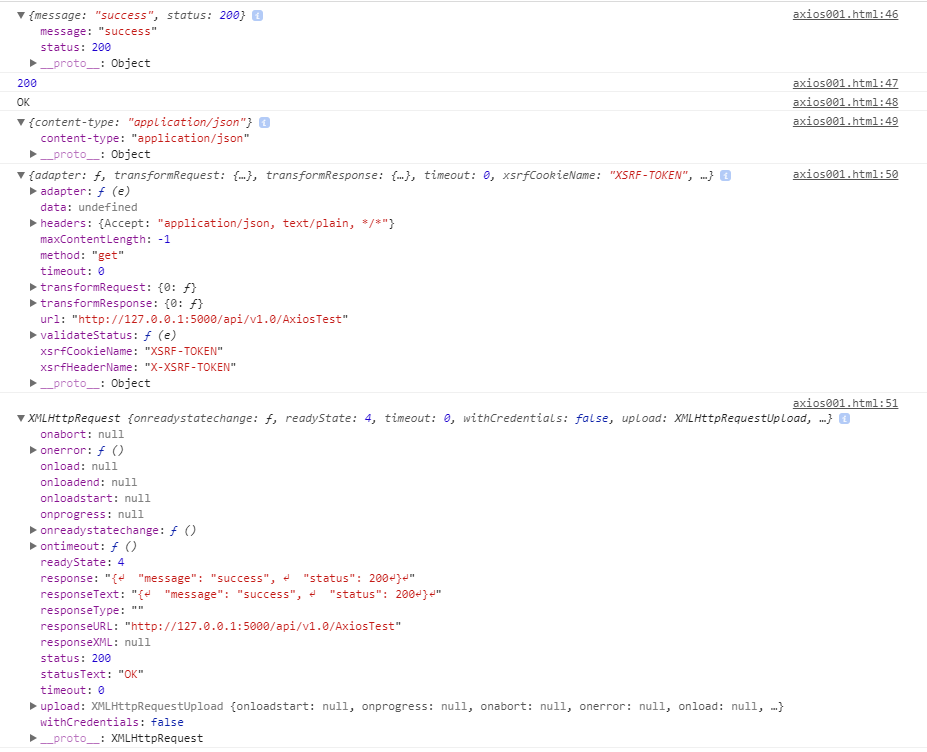

# import 

```js
// cdn
<script src="https://unpkg.com/axios/dist/axios.min.js"></script>
```
# request method
## get

```js
 axios.get("http://127.0.0.1:5000/api/v1.0/AxiosTest")
    .then(function (response) {
        console.log("success");
        console.log(response.data);
    })
    .catch(function (error) {
        console.log("fail");
        console.log(error['message']);
    });
```

## post 

```js
axios.post("http://127.0.0.1:5000/api/v1.0/AxiosTest", { "name": "buglan" })
    .then(function (response) {
        console.log("success");
        console.log(response.data);
    })
    .catch(function (error) {
        console.log("fail");
        console.log(error.data['message']);
    });
```

## delete

## head

## options 

## put

## patch

# Response Schema

- data 
- status
- statusText
- headers
- config
- request

```js
axios.get("http://127.0.0.1:5000/api/v1.0/AxiosTest")
    .then(function (response) {
        console.log(response.data);
        console.log(response.status);
        console.log(response.statusText);
        console.log(response.headers);
        console.log(response.config);
        console.log(response.request);
    })
    .catch(function (error) {
        console.log("fail");
        console.log(error['message']);
    });
};
```

